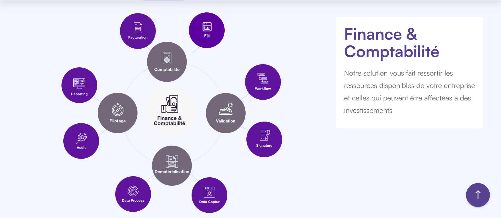
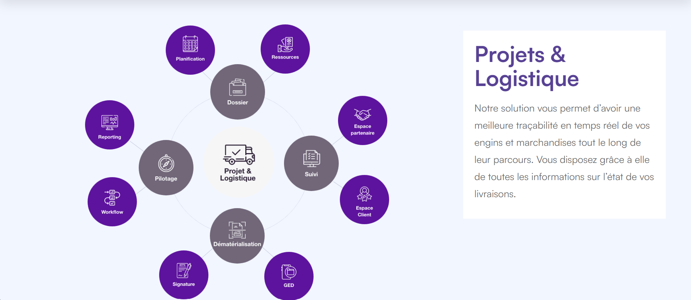
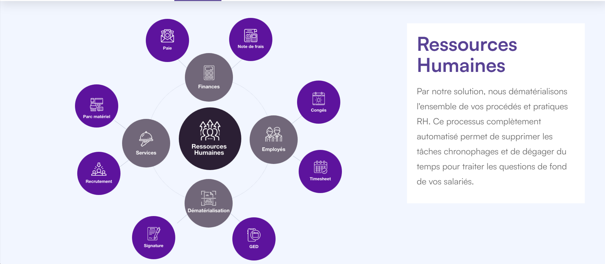
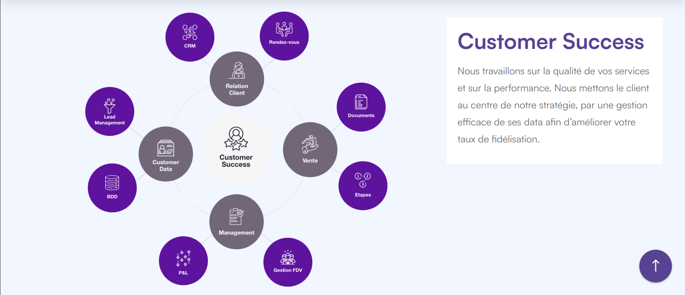
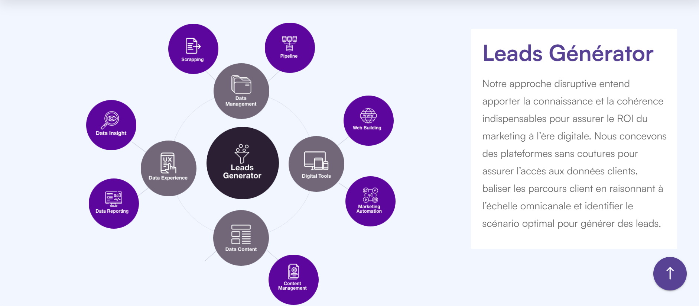
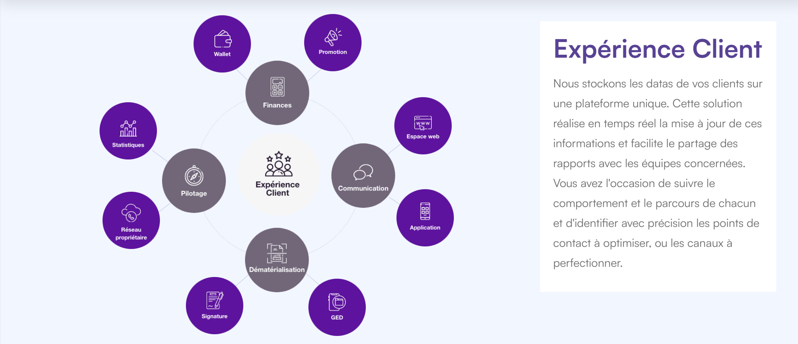

---

<h1 align="center">🧑‍💻 Bienvenue sur le repository de MADATA</h1>

<h3 align="center">
  Une plateforme intelligente 100% web de solutions connectées dans un espace de travail collaboratif.
</h3>

  

 

## ⚡ NOS SERVICES

 

## ⚡ NOS EXPERTISES

<h2 align="left" style="font-weight: bold;">
  6 domaines d’expertise pour répondre à tous vos besoins fonctionnels.
</h2>

<ol>
  <li>🧾 Finance & Comptabilité</li>
  <li>🗓️ Projets & Logistique</li>
  <li>🙋🏻‍♂️ Ressources Humaines</li>
  <li>✅ Customer Success</li>
  <li>🫱🏾‍🫲🏾 Leads Generator</li>
  <li>🌐 Expérience client</li>
</ol>

# 1 - 🧾 Finance & Comptabilité
<h3>Tous les outils dont vous avez besoin pour vous faire gagner du temps dans un système sans couture.</h3>

 

# 2 - 🗓️ Projets & Logistique
<h3>Anticiper sur les besoins et les ressources et agir en temps réel pour établir une norme d'excellence.</h3>

 

# 3 - 🙋🏻‍♂️ Ressources Humaines
<h3>Lier l'opérationnel et l'expérientiel pour optimiser votre gestion des Ressources Humaines.</h3>

# 4 - ✅ Customer Success
<h3>Automatiser les taches afin que les équipes commerciales se concentrent sur la relation clients et génèrent plus de revenus.</h3>

# 5 - 🫱🏾‍🫲🏾 Leads Generator
<h3>Générer en continu des prospects qualifiés pour nourrir la force commerciale en leads à closer.</h3>

# 6 - 🌐Expérience client
<h3>Des Applications Customer Centric connectées en back office avec toutes les solutions utilisées.</h3>

